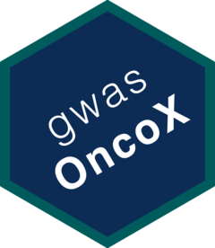

&nbsp;

# gwasOncoX 

The goal of **gwasOncoX** is to offer an R package that simplifies the process of retrieving variant data and track files (VCF, BED) for low-to-moderate risk variants associated with cancer, as found in [genome-wide association studies](https://www.ebi.ac.uk/gwas/). The package utilizes the [googledrive](https://googledrive.tidyverse.org/) R package to download the pre-processed and documented datasets to a local cache directory provided by the user.

### Installation

`remotes::install_github('sigven/gwasOncoX')`

### Usage

The package offers (currently) three different functions:

-   [`get_variants()`](https://sigven.github.io/gwasOncoX/reference/get_variants.html) - retrieves phenotype information related to GWAS variants in cancer

-   [`get_bed()`](https://sigven.github.io/gwasOncoX/reference/get_bed.html) - retrieves BED tracks ( *grch37* and *grch38* ) for variants associated with cancer

-   [`get_vcf()`](https://sigven.github.io/gwasOncoX/reference/get_vcf.html) - retrieves VCF files ( *grch37* and *grch38* ) for variants associated with cancer.

### IMPORTANT NOTE

If you use the datasets provided with **gwasOncoX**, make sure you properly cite the the [NHGRI-EBI Catalog of human genome-wide association studies](https://www.ebi.ac.uk/gwas/docs/about):

-   [Buniello et al., Nucleic Acids Res, 2019](https://pubmed.ncbi.nlm.nih.gov/30445434/)

### Contact

sigven AT ifi.uio.no
